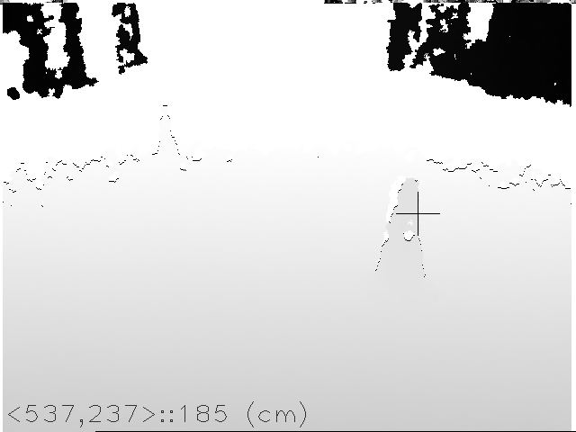

# pickinect
Get and recover the raw depth data from Kinect by [librekinect](https://github.com/xxorde/librekinect) + [OpenCV](http://opencv.org/).   
Assuming that you have installed opencv lib acoording your OS properly.

## load librekinect
- cd ./pickinect/src
- make
- make unload
- make load

## run
- cd ./pickinect
- make
- ./main

## about
the binary will generate grey scale depth-image in the dir.
- only for PC platform
    - due to the Raspberry Pi 2B's hardware is still too poor
    - try on RP3 now,but the way seems filled with twists and difficulties :'-(
